<div align="center">


</div>

<div align="center">


<br/>

[](https://github.com/abdurrahman253)
[](https://github.com/abdurrahman253?tab=followers)
[](https://github.com/abdurrahman253)

</div>


---


## 🎯 About Me

```javascript
const abdurRahman = {
    name: "Abdur Rahman",
    role: "MERN Stack Developer",
    location: "Bangladesh 🇧🇩",
    currentFocus: "Backend with Node.js",
    learning: ["Node.js", "Express.js", 
               "MongoDB", "System Design"],
    nextGoal: ["Full Stack Mastery", 
               "Python", "AI/ML"],
    passions: ["Clean Code", 
               "AI Technology", 
               "Problem Solving"],
    motto: "Discipline beats talent 💪"
};
```

### 🌟 Journey Highlights

- 🕌 **From Qawmi Madrasa → JavaScript Lover**
- 💼 **Learn Every Single Day, No Matter What**
- 🚀 **Code Between Work Shifts Daily**
- 🎨 **Complex Topics → Simple Solutions**
- 🌐 **Improving English & Building Projects**

<br clear="right"/>


---

## 🛠️ Tech Stack & Tools

<div align="center">

### 💻 Frontend Development
<p>
    
</p>

### ⚙️ Backend & Database
<p>
    
</p>

### 🔧 Tools & Technologies
<p>
    
</p>

</div>


---

## 📊 GitHub Statistics

<div align="center">
  
  
</div>

<br/>

<div align="center">
  
  
</div>

<br/>

<div align="center">
  
</div>


---

## 🏆 GitHub Trophies & Achievements

<div align="center">
  
[](https://github.com/abdurrahman253)

</div>


---

## 💡 Philosophy & Work Style

<div align="center">

<table>
<tr>
<td width="50%" align="center">

### 🎯 My Philosophy

**Consistency is My Superpower**

*"I write code between work shifts — consistency beats everything"*

**Discipline Over Talent**

*"I practice discipline daily, no matter how busy life gets"*

**Simplicity Over Complexity**

*"Turning complex topics into simple, clean solutions"*

</td>
<td width="50%" align="center">

### 💪 Daily Practice

✅ Learn web development every day

✅ Code between work shifts

✅ Build real solutions to real problems

✅ Improve English continuously

✅ Plan and execute new projects

✅ Explore AI tools and technologies

</td>
</tr>
</table>

</div>


---

## 🎯 Current Focus & Future Goals

```mermaid
graph LR
    A[🎯 Current] -->|Mastering| B[Node.js + Express]
    B --> C[MongoDB & Backend]
    C -->|Next Step| D[Full Stack Mastery]
    D -->|Then| E[Python Development]
    E -->|Future| F[AI/ML Engineering]
    
    style A fill:#00d9ff,stroke:#00d9ff,color:#000
    style B fill:#302b63,stroke:#00d9ff,color:#fff
    style C fill:#302b63,stroke:#00d9ff,color:#fff
    style D fill:#302b63,stroke:#00d9ff,color:#fff
    style E fill:#302b63,stroke:#00d9ff,color:#fff
    style F fill:#00ff88,stroke:#00ff88,color:#000
```

<div align="center">



### 🚀 Roadmap

**📍 Currently Working On:**
- ⚡ Building scalable MERN applications
- 🔥 Mastering Node.js, Express.js & MongoDB
- 🎨 Creating clean, maintainable code

**🎓 Next Learning Goals:**
- 🐍 Python Programming
- 🤖 AI/ML Fundamentals
- 📊 Data Structures & Algorithms
- 🏗️ System Design Patterns

</div>


---

## 🤝 Connect With Me

<div align="center">

### 💬 Let's Collaborate & Build Together!

<br/>

<a href="https://github.com/abdurrahman253">
  
</a>
<a href="https://www.facebook.com/abdur.rahman.36807">
  
</a>
<a href="https://x.com/AbdurRahma91153">
  
</a>
<a href="https://www.instagram.com/abdur1015rahman/">
  
</a>
<a href="https://wa.me/8801777678707">
  
</a>

<br/><br/>

### 📧 Open For:

**💼 Freelance Projects** • **🤝 Collaborations** • **💡 Innovative Ideas** • **🚀 Job Opportunities**

<br/>


</div>


---

<div align="center">

## 📈 Contribution Activity

<picture>
  <source media="(prefers-color-scheme: dark)" srcset="https://raw.githubusercontent.com/abdurrahman253/abdurrahman253/output/github-contribution-grid-snake-dark.svg">
  <source media="(prefers-color-scheme: light)" srcset="https://raw.githubusercontent.com/abdurrahman253/abdurrahman253/output/github-contribution-grid-snake.svg">
  
</picture>

</div>

---

<div align="center">

### 💭 Daily Inspiration


<br/><br/>

### ⚡ Current Mood

```ascii
  ╔═══════════════════════════════════════╗
  ║  💻 Coding Mode: ON                   ║
  ║  ☕ Coffee Level: Always Full         ║
  ║  🎯 Focus: Backend Development        ║
  ║  🔥 Motivation: Maximum               ║
  ║  📚 Learning: Never Stops             ║
  ╚═══════════════════════════════════════╝
```

</div>

---


<div align="center">

### ⭐ Show Some Love!

*If you like my work, don't forget to ⭐ star my repositories!*

<br/>

<sub>💙 Made with passion & dedication by [Abdur Rahman](https://github.com/abdurrahman253)</sub>

<br/>

**"Code, Learn, Repeat — Every Single Day!"**

</div>
